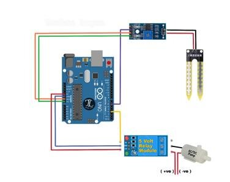
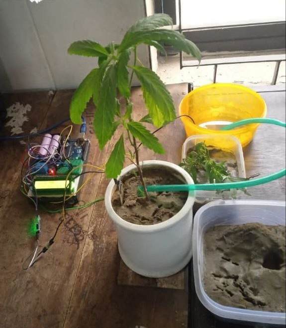

# Automatic Plant Watering System

This project is an automatic plant watering system built with Arduino. The system detects soil moisture using a sensor and controls a relay to activate the water pump when the soil is dry.

## Components Used
- Arduino Uno
- Soil Moisture Sensor
- Relay Module
- Water Pump

## Circuit Design

## Project showcase

